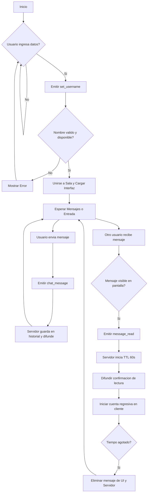
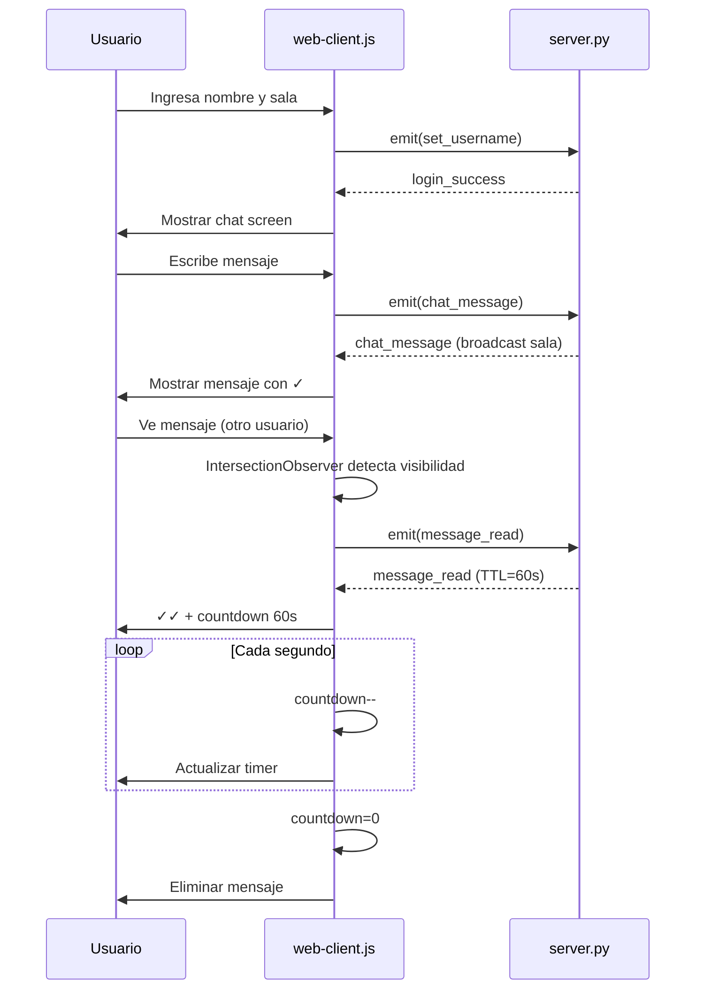
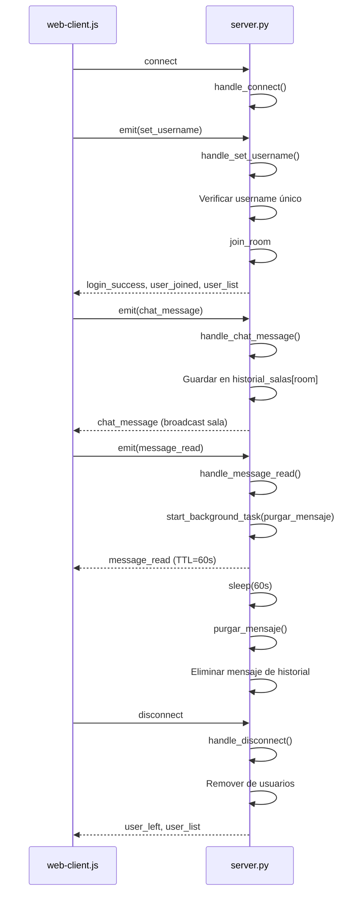

# Servidor Websocket con privacidad Avanzada

**Estudiantes:** Gabriel Murillo, Gabriel López  
**Fecha:** 06 de Mayo de 2026

## Funcionalidades
* Chat en tiempo real
* Implementación Web sockets
* Confirmación de envio y recepción de mensajes
* Mensajes temporales con tiempo de vida de 1 minuto
* Implementación de seguridad por nombres y acceso por código de sala
* Interfaz visual con:
    * Pantalla de ingreso
    * Chat visual
    * Lista de usuarios en la sala  

# Instrucciones de ejecución
1. Inicializar servidor ejecutando el comando **python server.py**
2. Inicializar servidor front ejecutando **node main.js**

# Explicación de implementación

## Cambios realizados respecto a la versión original

### 1. Validación obligatoria de nombre de usuario (`server.py`)

**Antes:** Se aceptaba cualquier conexión, usando `'Anonimo'` como valor por defecto.
```python
# ANTES
username = data.get('username', 'Anonimo')
```

**Ahora:** Se valida que el nombre exista, no esté vacío y sea único en el servidor.
```python
# AHORA
username = data.get('username')
if not username or username.strip() == "":
    emit('login_error', {'message': 'El nombre de usuario es obligatorio.'})
    return
if username in usuarios.values():
    emit('login_error', {'message': 'El nombre de usuario ya está en uso.'})
    return
```

---

### 2. Sistema de Salas privadas con `join_room` (`server.py`)

**Antes:** Los mensajes se enviaban con `broadcast=True`, llegando a todos los usuarios conectados.

**Ahora:** Cada usuario se une a una sala específica con un código, y los mensajes solo llegan a esa sala.
```python
# El usuario se une a una sala al autenticarse
join_room(room)

# Los mensajes solo se difunden dentro de la sala
emit('chat_message', msg_data, to=room)
```

---

### 3. TTL iniciado en la lectura, no en el envío (`server.py`)

**Antes:** No existía TTL. Los mensajes permanecían para siempre.

**Ahora:** El TTL de 60s se activa en el servidor solo cuando el destinatario confirma que leyó el mensaje. Se usa un hilo en segundo plano para purgar el mensaje del historial.
```python
@socketio.on('message_read')
def handle_message_read(data):
    def purgar_mensaje(r_name, m_id):
        socketio.sleep(60)  # Espera 60 segundos
        if r_name in historial_salas:
            historial_salas[r_name] = [
                m for m in historial_salas[r_name] if m.get('id') != m_id
            ]
    socketio.start_background_task(purgar_mensaje, room, msg_id)
    emit('message_read', {'id': msg_id, 'ttl': 60}, to=room)
```

---

### 4. Detección de visibilidad con `IntersectionObserver` (`web-client.js`)

**Antes:** No existía. El cliente no sabía si el mensaje fue visto realmente.

**Ahora:** Se observa si el elemento del mensaje es visible en el viewport. Solo entonces se emite `message_read`, iniciando el TTL.
```javascript
const observer = new IntersectionObserver((entries) => {
    entries.forEach(entry => {
        if (entry.isIntersecting) {
            // Solo marca como leído si la ventana tiene foco
            if (document.hasFocus()) {
                this.socket.emit('message_read', { id: data.id, room: this.room });
                observer.disconnect();
            }
        }
    });
}, { root: messagesContainer });

requestAnimationFrame(() => observer.observe(msgDiv));
```

---

### 5. Cuenta regresiva visual + autodestrucción (`web-client.js`)

**Antes:** No existía. Los mensajes nunca desaparecían.

**Ahora:** Al recibir la confirmación de lectura, el cliente inicia un intervalo que descuenta el TTL visualmente y elimina el elemento del DOM al llegar a 0.
```javascript
this.socket.on('message_read', (data) => {
    let timeLeft = data.ttl || 60;
    const intervalId = setInterval(() => {
        timeLeft--;
        if (timerSpan) timerSpan.textContent = timeLeft;
        if (timeLeft <= 0) {
            clearInterval(intervalId);
            msgDiv.remove(); // Elimina el mensaje del DOM
        }
    }, 1000);
});
```

---

### 6. Web Component con Shadow DOM (`web-client.js`)

**Antes:** La lógica del cliente estaba en un script global con variables sueltas.

**Ahora:** Todo está encapsulado en un Custom Element `<chat-app>` que extiende `HTMLElement`, con Shadow DOM para aislar estilos y lógica.
```javascript
class ChatApp extends HTMLElement {
    constructor() {
        super();
        this.attachShadow({ mode: 'open' }); // Encapsula CSS y DOM
        this.socket = null;
        this.username = '';
        this.room = '';
        this.render(); // Renderiza la UI dentro del shadow DOM
    }
}
customElements.define('chat-app', ChatApp);
```


## Eventos principales

### Cliente → Servidor
- `set_username`: Registra usuario en sala con código único
- `chat_message`: Envía mensaje con ID único y sala destino
- `message_read`: Notifica lectura de mensaje (inicia TTL)

### Servidor → Cliente
- `login_success`: Confirmación de acceso exitoso
- `login_error`: Error de autenticación
- `user_joined/user_left`: Notificaciones de entrada/salida
- `user_list`: Lista actualizada de usuarios
- `chat_message`: Distribución de mensajes a la sala
- `message_read`: Confirmación de lectura + TTL de 60s

## Arquitectura de privacidad
- Logs del servidor no exponen contenido ni identidades
- Mensajes temporales con TTL iniciado al ser leídos
- Eliminación automática del historial tras 60s

# Diagramas de Flujo

## Flujo General de la Aplicación



## Flujo Detallado del Web Client (web-client.js)



## Flujo Detallado del Server (server.py)



