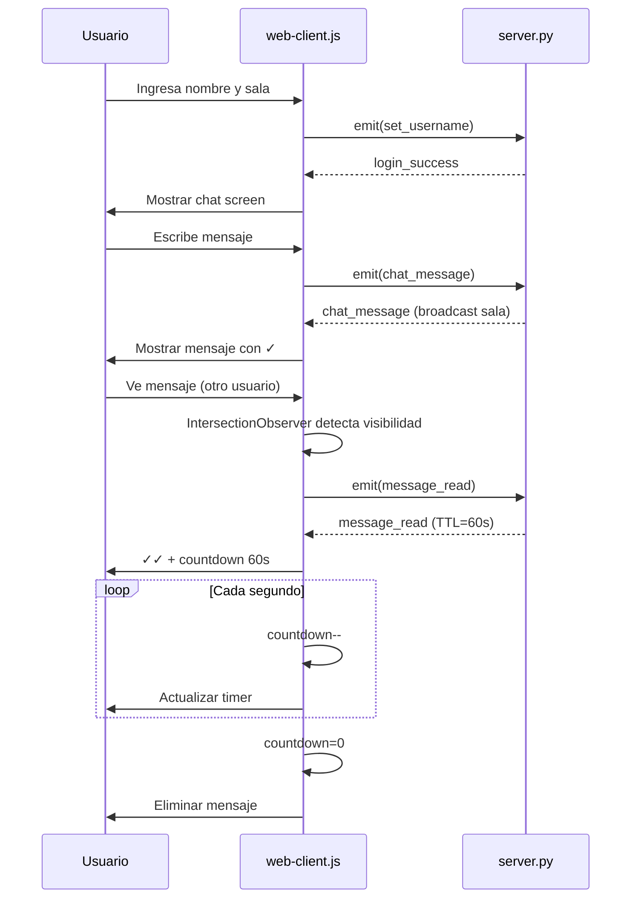
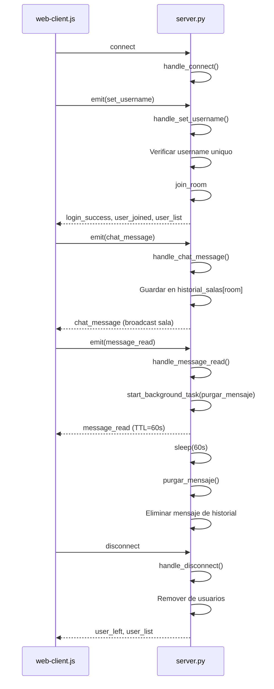

# Servidor Websocket con privacidad Avanzada

Nombres: Gabriel López, Gabriel Murillo

## Funcionalidades
* Chat en tiempo real
* Implementación Web sockets
* Confirmación de envio y recepción de mensajes
* Mensajes temporales con tiempo de vida de 1 minuto
* Implementación de seguridad por nombres y acceso por código de sala
* Interfaz visual con:
    * Pantalla de ingreso
    * Chat visual
    * Lista de usuarios en la sala  

# Instrucciones de ejecución
1. Inicializar servidor ejecutando el comando **python server.py**
2. Inicializar servidor front ejecutando **node main.js**

# Explicación de implementación

## Eventos principales

### Cliente → Servidor
- `set_username`: Registra usuario en sala con código único
- `chat_message`: Envía mensaje con ID único y sala destino
- `message_read`: Notifica lectura de mensaje (inicia TTL)

### Servidor → Cliente
- `login_success`: Confirmación de acceso exitoso
- `login_error`: Error de autenticación
- `user_joined/user_left`: Notificaciones de entrada/salida
- `user_list`: Lista actualizada de usuarios
- `chat_message`: Distribución de mensajes a la sala
- `message_read`: Confirmación de lectura + TTL de 60s

## Arquitectura de privacidad
- Logs del servidor no exponen contenido ni identidades
- Mensajes temporales con TTL iniciado al ser leídos
- Eliminación automática del historial tras 60s

# Diagrama de flujo

## Flujo del Web Client (web-client.js)

## Flujo del Server (server.py)

