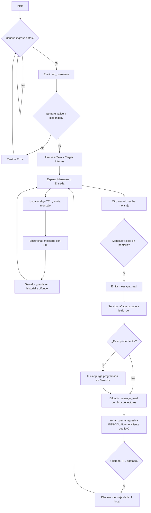
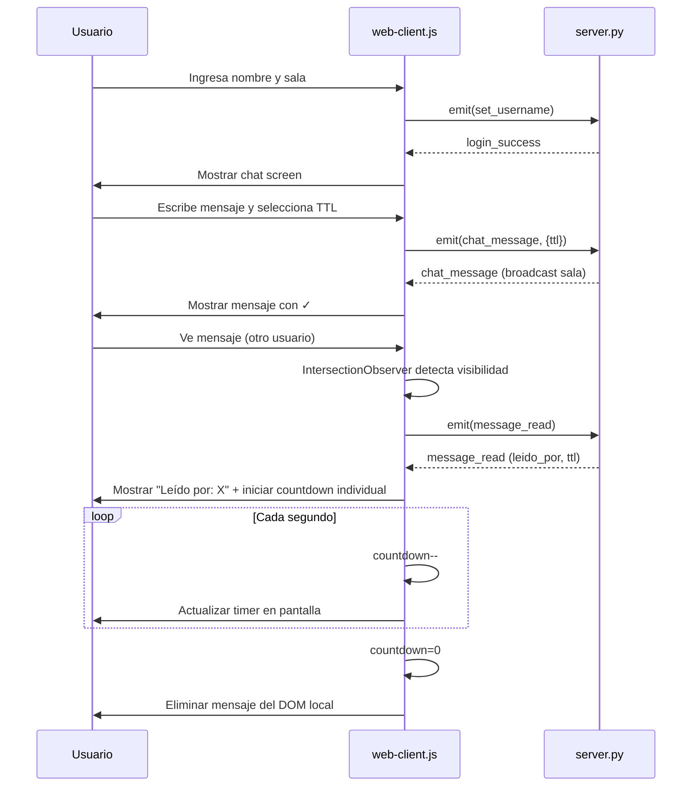
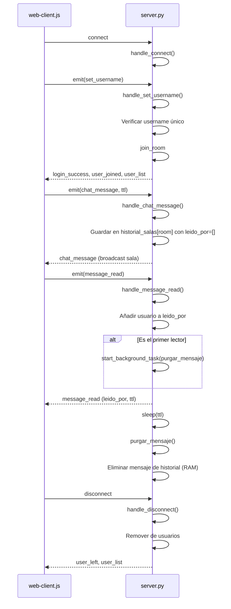

# Servidor Websocket con privacidad Avanzada

**Estudiantes:** Gabriel López, Gabriel Murillo,  
**Fecha:** 06 de Mayo de 2026

## Funcionalidades
* Chat en tiempo real
* Implementación Web sockets
* Confirmación de envio y recepción de mensajes
* Mensajes temporales con tiempo de vida de 1 minuto
* Implementación de seguridad por nombres y acceso por código de sala
* Interfaz visual con:
    * Pantalla de ingreso
    * Chat visual
    * Lista de usuarios en la sala  

# Instrucciones de ejecución

## 1. Requisitos Previos
* **Python 3.8** o superior.
* **Node.js** v16 o superior.
* Git instalado en el equipo.

## 2. Descarga del Proyecto
Clona el repositorio y entra a la carpeta principal:
```bash
git clone https://github.com/gamurigm/practica3
cd practica3
```

## 3. Ejecución del Servidor Backend (Python)
Abre una terminal en la carpeta del proyecto para iniciar el servicio de WebSockets:
```bash
# 1. (Opcional) Crea y activa un entorno virtual
python -m venv venv
venv\Scripts\activate  # En Windows

# 2. Instala las dependencias de Python
pip install flask flask_socketio flask_cors eventlet

# 3. Levanta el servidor (correrá en el puerto 5001)
python server.py
```

## 4. Ejecución del Cliente Frontend (Node.js)
Abre **una segunda pestaña de terminal** en la misma carpeta para levantar la interfaz web:
```bash
# 1. Instala las dependencias del frontend
npm install

# 2. Levanta el servidor web estático (correrá en el puerto 3030)
node main.js
```

## 5. Uso del Aplicativo
1. Abre tu navegador web y dirígete a **`http://localhost:3030`**.
2. **Login:** Ingresa tu *Nombre de Usuario* (obligatorio) y el *Código de Sala* a la que deseas unirte (ej. "1234"). Los mensajes solo se enviarán a quienes estén en tu misma sala.
3. **Chat Seguro:** Escribe un mensaje y selecciona su tiempo de vida (TTL: 10s, 1min o 5min).
4. **Autodestrucción:** Una vez enviado, el mensaje se destruirá automáticamente de la pantalla de cada participante una vez que transcurra el TTL (el tiempo empieza a correr de forma individual solo cuando el receptor lee el mensaje).
5. **Salir:** Para desconectarte, cierra la pestaña o envía exactamente `/exit` en el chat.
# Explicación de implementación

## Cambios realizados respecto a la versión original

### 1. Validación obligatoria de nombre de usuario (`server.py`)

**Antes:** Se aceptaba cualquier conexión, usando `'Anonimo'` como valor por defecto.
```python
# ANTES
username = data.get('username', 'Anonimo')
```

**Ahora:** Se valida que el nombre exista, no esté vacío y sea único en el servidor.
```python
# AHORA
username = data.get('username')
if not username or username.strip() == "":
    emit('login_error', {'message': 'El nombre de usuario es obligatorio.'})
    return
if username in usuarios.values():
    emit('login_error', {'message': 'El nombre de usuario ya está en uso.'})
    return
```

---

### 2. Sistema de Salas privadas con `join_room` (`server.py`)

**Antes:** Los mensajes se enviaban con `broadcast=True`, llegando a todos los usuarios conectados.

**Ahora:** Cada usuario se une a una sala específica con un código, y los mensajes solo llegan a esa sala.
```python
# El usuario se une a una sala al autenticarse
join_room(room)

# Los mensajes solo se difunden dentro de la sala
emit('chat_message', msg_data, to=room)
```

---

### 3. TTL configurable e Individual por Cliente (`server.py` + `web-client.js`)

**Antes:** No existía TTL o era global (el primer lector borraba el mensaje para todos).

**Ahora:** El emisor elige el TTL (10s, 1min o 5min) desde un selector en la UI. El TTL es **individual para cada cliente** (Opción A). La cuenta regresiva de destrucción empieza de forma independiente en la pantalla de cada receptor solo en el momento en que *ese receptor* lee el mensaje. El servidor purga su copia de seguridad tras la primera lectura para no mantener historial eterno.
```python
# Servidor lee el TTL enviado por el cliente
ttl = int(data.get('ttl', 60))

# El servidor purga la memoria tras la primera lectura
if len(leido_por) == 1:
    socketio.start_background_task(purgar_mensaje, room, msg_id, ttl)
```
```javascript
// Cliente inicia temporizador SOLO cuando él lo lee, independiente del resto
if (isOwn || data.leido_por.includes(this.username)) {
    this.startLocalCountdown(msgDiv, data.ttl);
}
```

---

### 4. Confirmación de Lectura Grupal y Visibilidad (`web-client.js`)

**Antes:** El "doble check" no indicaba quién había leído en una sala con múltiples personas.

**Ahora:** El servidor rastrea un arreglo `leido_por`. Se observa si el elemento del mensaje es visible (`IntersectionObserver`) y se emite la lectura. El remitente y los demás pueden ver exactamente quién ha leído el mensaje en la interfaz (`Leído por: Juan, Ana`).
```javascript
let readersSpan = msgDiv.querySelector('.readers');
const readersText = `Leído por: ${data.leido_por.join(', ')}`;
```

---

### 5. Cuenta regresiva visual + autodestrucción (`web-client.js`)

**Antes:** No existía. Los mensajes nunca desaparecían.

**Ahora:** Al recibir la confirmación de lectura, el cliente inicia un intervalo que descuenta el TTL visualmente y elimina el elemento del DOM al llegar a 0.
```javascript
this.socket.on('message_read', (data) => {
    let timeLeft = data.ttl || 60;
    const intervalId = setInterval(() => {
        timeLeft--;
        if (timerSpan) timerSpan.textContent = timeLeft;
        if (timeLeft <= 0) {
            clearInterval(intervalId);
            msgDiv.remove(); // Elimina el mensaje del DOM
        }
    }, 1000);
});
```

---

### 6. Web Component con Shadow DOM (`web-client.js`)

**Antes:** La lógica del cliente estaba en un script global con variables sueltas.

**Ahora:** Todo está encapsulado en un Custom Element `<chat-app>` que extiende `HTMLElement`, con Shadow DOM para aislar estilos y lógica.
```javascript
class ChatApp extends HTMLElement {
    constructor() {
        super();
        this.attachShadow({ mode: 'open' }); // Encapsula CSS y DOM
        this.socket = null;
        this.username = '';
        this.room = '';
        this.render();
    }
}
customElements.define('chat-app', ChatApp);
```

---

### 7. Selector de TTL en la interfaz (`web-client.js`)

**Antes:** No existía. El TTL estaba hardcodeado en 60s.

**Ahora:** El emisor elige el tiempo de vida del mensaje antes de enviarlo mediante un `<select>` en la barra de chat. El valor se pasa directamente al servidor con cada mensaje.
```javascript
// UI: selector visible junto al input de texto
<select id="ttl-select">
    <option value="10">⏱ 10s</option>
    <option value="60" selected>⏱ 1 min</option>
    <option value="300">⏱ 5 min</option>
</select>

// JS: se lee el valor al enviar
const ttl = parseInt(shadow.getElementById('ttl-select').value);
this.socket.emit('chat_message', { id: msgId, message, room: this.room, ttl });
```


## Eventos principales

### Cliente → Servidor
- `set_username`: Registra usuario en sala con código único
- `chat_message`: Envía mensaje con ID único y sala destino
- `message_read`: Notifica lectura de mensaje (inicia TTL)

### Servidor → Cliente
- `login_success`: Confirmación de acceso exitoso
- `login_error`: Error de autenticación
- `user_joined/user_left`: Notificaciones de entrada/salida
- `user_list`: Lista actualizada de usuarios
- `chat_message`: Distribución de mensajes a la sala
- `message_read`: Confirmación de lectura + TTL de 60s

## Arquitectura de privacidad
- Logs del servidor no exponen contenido ni identidades
- Mensajes temporales con TTL iniciado al ser leídos
- Eliminación automática del historial tras 60s

# Diagramas de Flujo

## Flujo General de la Aplicación



## Flujo Detallado del Web Client (web-client.js)



## Flujo Detallado del Server (server.py)



